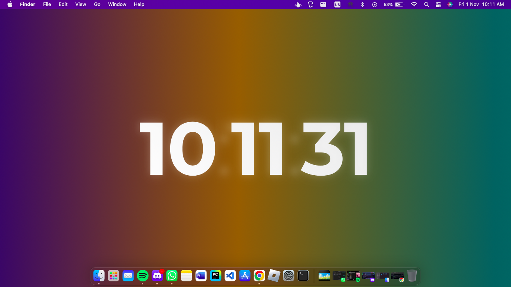
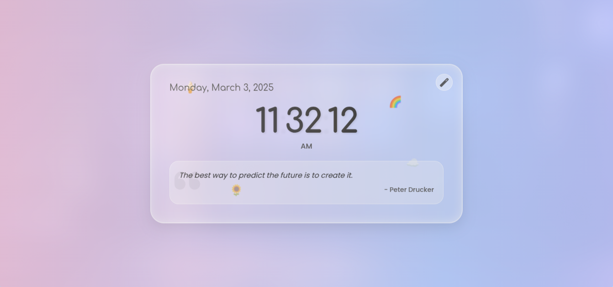
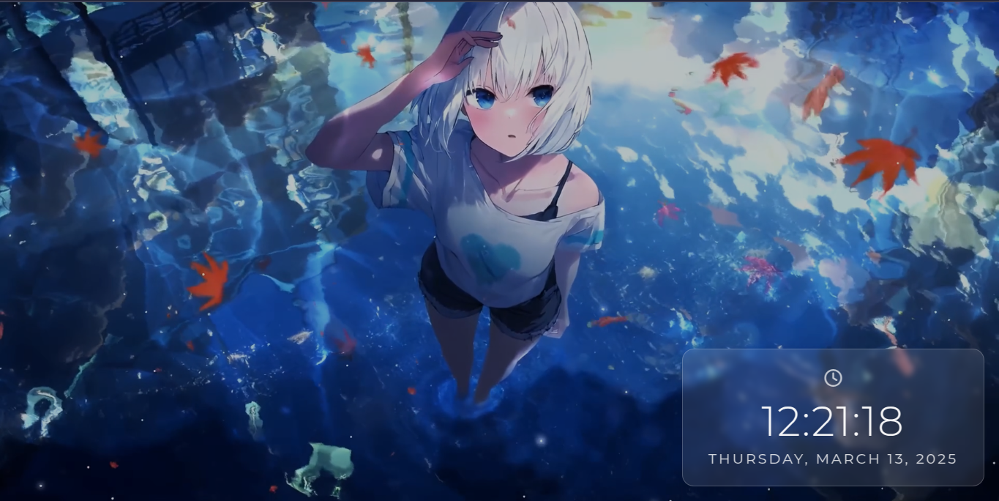

  

---
A sleek, minimalistic web wallpaper that displays a live clock, designed to enhance your desktop with a touch of functionality and style. Perfectly optimized for use with *Plash* on macOS, but compatible with other platforms as well.

  

---

<table><tr><td>V1</td><td>Muffen</td></tr><tr><td>
</td><td>
</td></tr></table>

<table><tr><td>Livey</td></tr><tr><td>
</td></tr></table>

> [!NOTE]
> The Livey variant includes copyrighted wallpaper from [Motion Backgrounds](https://motionbgs.com/girl-blue-eyes).

> [!IMPORTANT]
> You can customize Livey by editing `conf.json`

  

---

- **Live Clock** — Displays current time in a clean, minimal design.
- **Seamless Integration** — Works smoothly with Plash for macOS.
- **Customizable Positioning** — Adjust the wallpaper's look using Splash settings.
- **Gradient Animation** - Added Beautiful Gradient Animations

  

---

- **Plash (macOS)** — [Plash](https://sindresorhus.com/plash)
- **Rainmeter (Windows)** — [Rainmeter](https://www.rainmeter.net/)
- **Wallpaper Engine (Windows)** — [Wallpaper Engine](https://www.wallpaperengine.io/)
- **Komorebi (Linux)** — [Komorebi](https://github.com/cheesecakeufo/komorebi)
- **ScreenPlay (Cross-platform)** — [ScreenPlay](https://screenplay.dev/)
- **WinDynamicDesktop (Windows)** — [WinDynamicDesktop](https://github.com/t1m0thyj/WinDynamicDesktop)
- **Wallpapers (GNOME)** — [GNOME Wallpapers](https://extensions.gnome.org/extension/1048/wallpaper/)

  

---

- v1 : [ClockX v1](https://yashokuu.github.io/clockX/v1/)
- Heart : [ClockX Muffen](https://yashokuu.github.io/clockX/muffen/)
- Livey : [ClockX Livey](https://yashokuu.github.io/clockX/livey/)

  

---
Contributions are welcome! Please fork the repository and submit a pull request.

  

---

This project is licensed under the MIT License. See the [LICENSE](LICENSE) file for details.